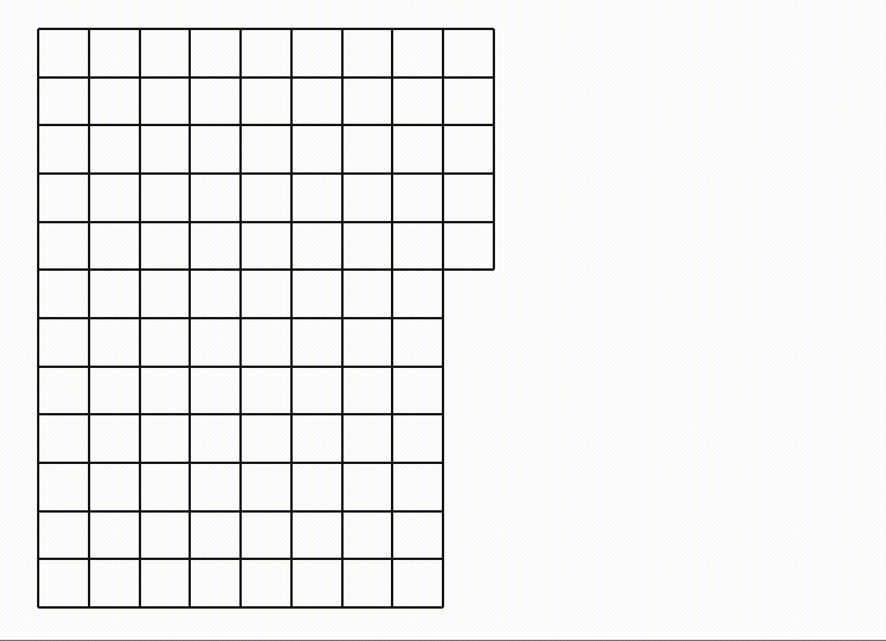

# Maze Generator and Solver

A simple Python application for generating mazes and solving them using Tkinter.

## Features

Maze Generation: Create mazes of various sizes using different algorithms.
Maze Solving: Solve generated mazes using a pathfinding algorithm.

## Requirements

Python 3.x
Tkinter (usually included in Python installations)

Contributions are welcome! Please feel free to submit issues or pull requests.
